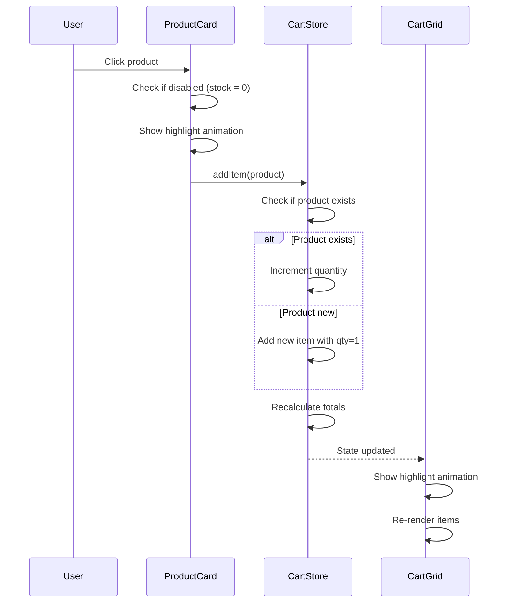
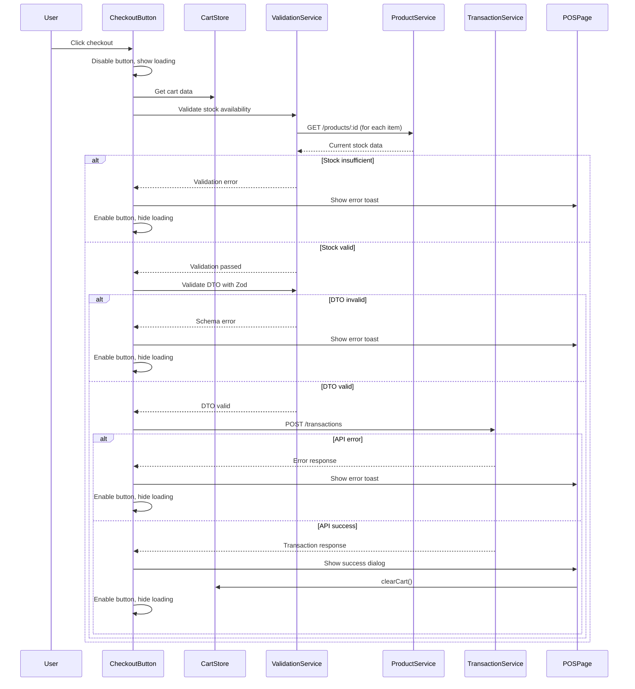
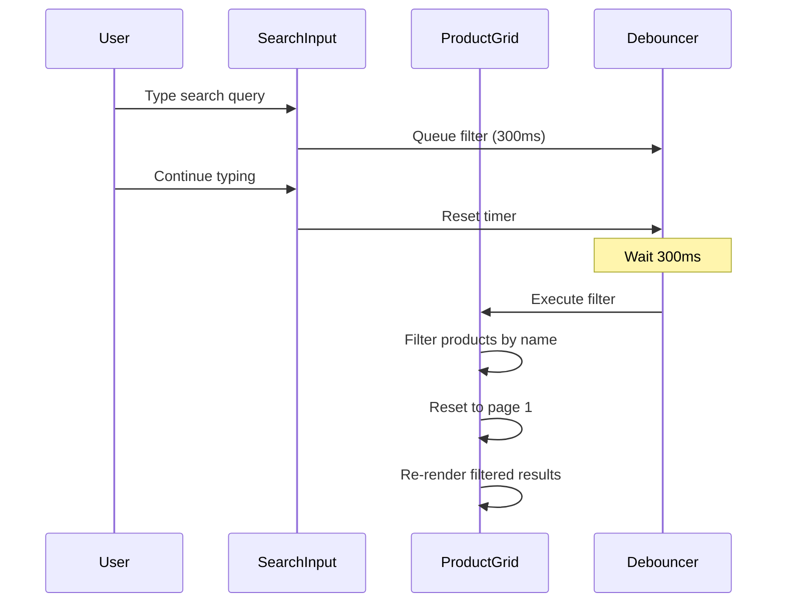

# Design Document: POS Terminal Interface

## Overview

The POS Terminal Interface is a Vue 3 + TypeScript frontend module that provides cashiers with an efficient, touch-friendly interface for processing sales transactions. The design follows a dual-grid layout pattern with a 60/40 split between product browsing and cart management, optimized for both desktop and tablet touchscreen devices.

### Key Design Goals

- **Simplicity**: Clean, intuitive interface requiring minimal training
- **Performance**: Sub-300ms response times for search and UI updates
- **Reliability**: Comprehensive validation and error handling
- **Accessibility**: WCAG-compliant with full keyboard navigation support
- **Maintainability**: Clear separation of concerns using Vue 3 Composition API and Pinia

### Technology Stack

- **Framework**: Vue 3 with Composition API and TypeScript
- **UI Components**: PrimeVue (DataTable, Button, InputNumber, Dropdown, Dialog, Card)
- **Styling**: Tailwind CSS with PrimeVue theme integration
- **State Management**: Pinia with modular store pattern
- **Validation**: Zod for runtime type validation
- **HTTP Client**: Axios with interceptors for authentication
- **Build Tool**: Vite

## Architecture

### High-Level Architecture

The POS Terminal Interface follows a layered architecture pattern:

```
┌─────────────────────────────────────────────────────────┐
│                    Presentation Layer                    │
│  ┌──────────────────┐         ┌──────────────────┐     │
│  │  Product Grid    │         │    Cart Grid     │     │
│  │   Component      │         │    Component     │     │
│  └──────────────────┘         └──────────────────┘     │
│           │                            │                 │
│           └────────────┬───────────────┘                │
│                        │                                 │
└────────────────────────┼─────────────────────────────────┘
                         │
┌────────────────────────┼─────────────────────────────────┐
│                 State Management Layer                   │
│                  ┌──────────────┐                        │
│                  │  Cart Store  │                        │
│                  │   (Pinia)    │                        │
│                  └──────────────┘                        │
└────────────────────────┼─────────────────────────────────┘
                         │
┌────────────────────────┼─────────────────────────────────┐
│                   Service Layer                          │
│  ┌──────────────┐  ┌──────────────┐  ┌──────────────┐  │
│  │   Product    │  │ Transaction  │  │  Validation  │  │
│  │   Service    │  │   Service    │  │   Service    │  │
│  └──────────────┘  └──────────────┘  └──────────────┘  │
└────────────────────────┼─────────────────────────────────┘
                         │
┌────────────────────────┼─────────────────────────────────┐
│                    API Layer                             │
│                  ┌──────────────┐                        │
│                  │ Axios Client │                        │
│                  │ (with auth)  │                        │
│                  └──────────────┘                        │
└──────────────────────────────────────────────────────────┘
```

### Module Structure

```
src/modules/pos/
├── components/
│   ├── ProductGrid.vue          # Product display and selection
│   ├── ProductCard.vue          # Individual product card
│   ├── CartGrid.vue             # Cart display and management
│   ├── CartItem.vue             # Individual cart item row
│   ├── PaymentSelector.vue     # Payment method selection
│   └── CheckoutButton.vue       # Checkout action button
├── pages/
│   └── index.vue                # Main POS terminal page
├── stores/
│   ├── index.ts                 # Cart store definition
│   ├── state.ts                 # Cart state interface
│   ├── actions.ts               # Cart actions
│   └── getters.ts               # Cart computed properties
├── services/
│   ├── api.ts                   # API service functions
│   ├── validation.ts            # Zod schemas
│   └── constants.ts             # Constants and enums
├── types/
│   └── index.ts                 # TypeScript interfaces
└── router/
    └── index.ts                 # Route definitions
```

## Components and Interfaces

### Component Hierarchy

```
POSTerminalPage (index.vue)
├── ProductGrid
│   └── ProductCard (multiple instances)
└── CartGrid
    ├── CartItem (multiple instances)
    ├── PaymentSelector
    └── CheckoutButton
```

### Component Specifications

#### 1. POSTerminalPage (index.vue)

**Purpose**: Root container managing layout and component orchestration

**Props**: None (route-level component)

**Responsibilities**:
- Render two-column responsive grid layout
- Initialize cart store on mount
- Handle global error boundaries
- Manage confirmation dialog state

**Layout**:
```vue
<template>
  <div class="pos-terminal grid grid-cols-1 lg:grid-cols-10 gap-4 p-4">
    <div class="lg:col-span-6">
      <ProductGrid />
    </div>
    <div class="lg:col-span-4">
      <CartGrid />
    </div>
  </div>
  <Dialog v-model:visible="showConfirmation" ... />
</template>
```

**Responsive Breakpoints**:
- Mobile/Tablet (< 1024px): Stacked layout
- Desktop (≥ 1024px): 60/40 split (6/10 and 4/10 columns)

#### 2. ProductGrid Component

**Purpose**: Display searchable, paginated product list

**Props**: None (uses product service directly)

**State**:
```typescript
interface ProductGridState {
  products: Product[];
  filteredProducts: Product[];
  searchQuery: string;
  loading: boolean;
  error: string | null;
  currentPage: number;
  pageSize: number;
}
```

**Key Features**:
- Real-time search with 300ms debounce
- Pagination (20 items per page)
- Loading skeleton states
- Error retry mechanism
- Touch-optimized product cards (min 44x44px)

**PrimeVue Components Used**:
- `DataView` for product grid layout
- `InputText` for search
- `Paginator` for pagination
- `Skeleton` for loading states

#### 3. ProductCard Component

**Purpose**: Display individual product with click-to-add interaction

**Props**:
```typescript
interface ProductCardProps {
  product: Product;
  disabled: boolean; // true when stock is 0
}
```

**Emits**:
- `add-to-cart`: Emitted when product is clicked

**Visual States**:
- Default: White background, hover effect
- Disabled: Gray background, cursor not-allowed
- Active (on click): Brief highlight animation (200ms)

**Accessibility**:
- ARIA label: "Add {product.name} to cart, price {price}, stock {stock}"
- Keyboard: Enter/Space to add to cart
- Focus visible indicator

#### 4. CartGrid Component

**Purpose**: Display cart items, totals, and checkout controls

**Props**: None (uses cart store)

**Computed Properties**:
```typescript
const cartItems = computed(() => cartStore.items);
const cartTotal = computed(() => cartStore.total);
const itemCount = computed(() => cartStore.itemCount);
const canCheckout = computed(() => cartStore.items.length > 0);
```

**Layout Sections**:
1. Header: "Cart ({itemCount} items)"
2. Items List: Scrollable area with CartItem components
3. Summary: Total amount with currency formatting
4. Payment Selector
5. Checkout Button

**Empty State**:
```vue
<div v-if="cartItems.length === 0" class="text-center py-8">
  <i class="pi pi-shopping-cart text-4xl text-gray-400"></i>
  <p class="text-gray-500 mt-2">No items in cart</p>
</div>
```

#### 5. CartItem Component

**Purpose**: Display and manage individual cart item

**Props**:
```typescript
interface CartItemProps {
  item: CartItem;
}
```

**Emits**:
- `update-quantity`: (productId: string, quantity: number)
- `remove`: (productId: string)

**Layout**:
```
┌─────────────────────────────────────────────────┐
│ Product Name                          [Remove]  │
│ $10.00 × [Qty: 2] = $20.00                     │
│ Stock: 15 available                             │
└─────────────────────────────────────────────────┘
```

**Validation**:
- Quantity min: 1
- Quantity max: Available stock
- Real-time validation with error messages

**PrimeVue Components**:
- `InputNumber` for quantity (with +/- buttons)
- `Button` for remove action

#### 6. PaymentSelector Component

**Purpose**: Select payment method for transaction

**Props**: None (uses cart store)

**Payment Methods**:
```typescript
enum PaymentMethod {
  CASH = 'cash',
  QRIS = 'qris',
  TRANSFER = 'transfer'
}
```

**UI Design**:
- Radio button group with icons
- Default selection: CASH
- Touch-friendly targets (min 44x44px)

**PrimeVue Components**:
- `RadioButton` for each payment method
- Custom styling with Tailwind

#### 7. CheckoutButton Component

**Purpose**: Trigger transaction submission with validation

**Props**:
```typescript
interface CheckoutButtonProps {
  disabled: boolean;
  loading: boolean;
}
```

**States**:
- Enabled: Primary color, clickable
- Disabled: Gray, cursor not-allowed
- Loading: Spinner icon, disabled

**Validation Flow**:
1. Check cart not empty
2. Validate stock availability
3. Validate transaction DTO
4. Submit to backend
5. Handle response

## Data Models

### TypeScript Interfaces

```typescript
// Product from backend
interface Product {
  id: string; // UUID
  name: string;
  price: number;
  stock: number;
  category?: string;
  image_url?: string;
}

// Cart item (extended product)
interface CartItem {
  product_id: string;
  name: string;
  price: number;
  quantity: number;
  stock: number; // For validation
  subtotal: number; // Computed: price * quantity
}

// Transaction DTO for submission
interface TransactionDTO {
  outlet_id: string; // UUID from auth context
  payment_method: 'cash' | 'qris' | 'transfer';
  items: TransactionItemDTO[];
}

interface TransactionItemDTO {
  product_id: string; // UUID
  quantity: number; // > 0
}

// Transaction response
interface TransactionResponse {
  id: string; // UUID
  total: number;
  payment_method: string;
  created_at: string;
  items: TransactionItemDTO[];
}

// API error response
interface ApiError {
  message: string;
  statusCode: number;
  error?: string;
}
```

### Zod Validation Schemas

```typescript
import { z } from 'zod';

// UUID validation
const uuidSchema = z.string().uuid();

// Payment method enum
const paymentMethodSchema = z.enum(['cash', 'qris', 'transfer']);

// Transaction item schema
const transactionItemSchema = z.object({
  product_id: uuidSchema,
  quantity: z.number().int().positive()
});

// Transaction DTO schema
export const transactionDTOSchema = z.object({
  outlet_id: uuidSchema,
  payment_method: paymentMethodSchema,
  items: z.array(transactionItemSchema).min(1)
});

// Type inference
export type TransactionDTO = z.infer<typeof transactionDTOSchema>;
```

### Pinia Store State

```typescript
// Cart store state
interface CartState {
  items: CartItem[];
  payment_method: 'cash' | 'qris' | 'transfer';
  outlet_id: string | null; // From auth context
}

// Store getters
interface CartGetters {
  total: (state: CartState) => number;
  itemCount: (state: CartState) => number;
  isEmpty: (state: CartState) => boolean;
  canCheckout: (state: CartState) => boolean;
}

// Store actions
interface CartActions {
  addItem(product: Product): void;
  updateQuantity(productId: string, quantity: number): void;
  removeItem(productId: string): void;
  setPaymentMethod(method: 'cash' | 'qris' | 'transfer'): void;
  clearCart(): void;
  initializeOutlet(outletId: string): void;
}
```

## Data Flow

### Add Product to Cart Flow



### Checkout Flow



### Search Flow



## Service Layer Design

### Product Service (api.ts)

```typescript
import api from '@/plugins/axios';
import type { Product } from '../types';

export const getProducts = async (params?: {
  search?: string;
  page?: number;
  limit?: number;
}): Promise<Product[]> => {
  const response = await api.get('/api/v1/products', { params });
  return response.data;
};

export const getProductById = async (id: string): Promise<Product> => {
  const response = await api.get(`/api/v1/products/${id}`);
  return response.data;
};
```

### Transaction Service (api.ts)

```typescript
import api from '@/plugins/axios';
import type { TransactionDTO, TransactionResponse } from '../types';

export const createTransaction = async (
  data: TransactionDTO
): Promise<TransactionResponse> => {
  const response = await api.post('/api/v1/transactions', data);
  return response.data;
};
```

### Validation Service (validation.ts)

```typescript
import { transactionDTOSchema } from './schemas';
import { getProductById } from './api';
import type { CartItem, TransactionDTO } from '../types';

export class ValidationService {
  /**
   * Validate stock availability for all cart items
   */
  static async validateStock(items: CartItem[]): Promise<{
    valid: boolean;
    errors: string[];
  }> {
    const errors: string[] = [];
    
    for (const item of items) {
      try {
        const product = await getProductById(item.product_id);
        
        if (product.stock < item.quantity) {
          errors.push(
            `${item.name}: Insufficient stock (available: ${product.stock}, requested: ${item.quantity})`
          );
        }
      } catch (error) {
        errors.push(`${item.name}: Failed to verify stock`);
      }
    }
    
    return {
      valid: errors.length === 0,
      errors
    };
  }
  
  /**
   * Validate transaction DTO with Zod schema
   */
  static validateTransactionDTO(dto: unknown): {
    valid: boolean;
    data?: TransactionDTO;
    errors?: string[];
  } {
    const result = transactionDTOSchema.safeParse(dto);
    
    if (result.success) {
      return { valid: true, data: result.data };
    }
    
    return {
      valid: false,
      errors: result.error.errors.map(e => `${e.path.join('.')}: ${e.message}`)
    };
  }
}
```

## State Management Design

### Cart Store Implementation

```typescript
// stores/state.ts
import type { CartItem } from '../types';

export interface CartState {
  items: CartItem[];
  payment_method: 'cash' | 'qris' | 'transfer';
  outlet_id: string | null;
}

export function state(): CartState {
  return {
    items: [],
    payment_method: 'cash',
    outlet_id: null
  };
}
```

```typescript
// stores/getters.ts
import type { CartState } from './state';

export const getters = {
  total: (state: CartState): number => {
    return state.items.reduce((sum, item) => sum + item.subtotal, 0);
  },
  
  itemCount: (state: CartState): number => {
    return state.items.reduce((sum, item) => sum + item.quantity, 0);
  },
  
  isEmpty: (state: CartState): boolean => {
    return state.items.length === 0;
  },
  
  canCheckout: (state: CartState): boolean => {
    return state.items.length > 0 && state.outlet_id !== null;
  }
};
```

```typescript
// stores/actions.ts
import type { Product } from '../types';

export const actions = {
  addItem(product: Product) {
    const existingItem = this.items.find(
      item => item.product_id === product.id
    );
    
    if (existingItem) {
      // Increment quantity if not exceeding stock
      if (existingItem.quantity < existingItem.stock) {
        existingItem.quantity += 1;
        existingItem.subtotal = existingItem.price * existingItem.quantity;
      }
    } else {
      // Add new item
      this.items.push({
        product_id: product.id,
        name: product.name,
        price: product.price,
        quantity: 1,
        stock: product.stock,
        subtotal: product.price
      });
    }
  },
  
  updateQuantity(productId: string, quantity: number) {
    const item = this.items.find(i => i.product_id === productId);
    
    if (item) {
      // Validate quantity
      if (quantity < 1 || quantity > item.stock) {
        throw new Error('Invalid quantity');
      }
      
      item.quantity = quantity;
      item.subtotal = item.price * quantity;
    }
  },
  
  removeItem(productId: string) {
    const index = this.items.findIndex(i => i.product_id === productId);
    if (index !== -1) {
      this.items.splice(index, 1);
    }
  },
  
  setPaymentMethod(method: 'cash' | 'qris' | 'transfer') {
    this.payment_method = method;
  },
  
  clearCart() {
    this.items = [];
    this.payment_method = 'cash';
  },
  
  initializeOutlet(outletId: string) {
    this.outlet_id = outletId;
  }
};
```

### Store Usage Pattern

```typescript
// In components
import { useCartStore } from '@/modules/pos/stores';

const cartStore = useCartStore();

// Add item
const handleProductClick = (product: Product) => {
  cartStore.addItem(product);
};

// Access computed values
const total = computed(() => cartStore.total);
const itemCount = computed(() => cartStore.itemCount);
```


## Correctness Properties

*A property is a characteristic or behavior that should hold true across all valid executions of a system—essentially, a formal statement about what the system should do. Properties serve as the bridge between human-readable specifications and machine-verifiable correctness guarantees.*

### Property Reflection

After analyzing all acceptance criteria, I identified several areas of redundancy:

1. **Cart item rendering properties (4.1, 4.2, 5.1, 6.1)** can be consolidated - they all verify that cart items display required information and controls
2. **Validation properties (5.3, 5.4, 11.2, 11.3, 11.4)** overlap - they all validate input constraints
3. **Stock validation properties (9.1, 9.2, 9.3)** are related - they all ensure stock availability before checkout
4. **Touch target properties (14.1, 14.2, 14.3)** can be combined - they all verify minimum touch target sizes
5. **ARIA label properties (18.1, 18.2, 18.3)** can be combined - they all verify accessibility attributes

The following properties represent the unique, non-redundant validation requirements:

### Property 1: Product Display Completeness

*For any* product returned from the API, the rendered product card must display the product name, price, and current stock.

**Validates: Requirements 1.2**

### Property 2: Pagination Threshold

*For any* product list with more than 20 items, the Product Grid must display pagination controls and show at most 20 items per page.

**Validates: Requirements 1.5**

### Property 3: Search Filter Accuracy

*For any* search query and product list, all displayed products must have names that contain the search term (case-insensitive), and all products matching the search term must be displayed.

**Validates: Requirements 2.2**

### Property 4: Search Clear Restoration

*For any* product list, applying a search filter and then clearing it must restore the complete original product list.

**Validates: Requirements 2.4**

### Property 5: Add Product to Cart

*For any* product not currently in the cart, adding it to the cart must create a cart item with quantity 1 and the correct product details.

**Validates: Requirements 3.1**

### Property 6: Increment Existing Cart Item

*For any* product already in the cart with quantity less than available stock, adding it again must increment the quantity by 1 without creating a duplicate cart item.

**Validates: Requirements 3.2**

### Property 7: Cart Item Display Completeness

*For any* cart item, the rendered display must show product name, unit price, quantity, subtotal, and provide quantity controls and a remove button.

**Validates: Requirements 4.1, 5.1, 6.1**

### Property 8: Subtotal Calculation

*For any* cart item, the subtotal must equal the unit price multiplied by the quantity.

**Validates: Requirements 4.2**

### Property 9: Quantity Update

*For any* cart item and valid quantity (1 ≤ quantity ≤ stock), updating the quantity must change the item's quantity and recalculate the subtotal.

**Validates: Requirements 5.2, 5.5**

### Property 10: Quantity Validation

*For any* cart item, attempting to set quantity less than 1 or greater than available stock must be rejected with a validation error.

**Validates: Requirements 5.3, 5.4**

### Property 11: Remove Cart Item

*For any* cart item, removing it must delete the item from the cart and update the cart display.

**Validates: Requirements 6.2**

### Property 12: Cart Total Calculation

*For any* cart state, the total must equal the sum of all item subtotals.

**Validates: Requirements 7.1, 7.2**

### Property 13: Currency Formatting

*For any* monetary amount (subtotal or total), the displayed value must be formatted with proper currency notation (e.g., "$10.00").

**Validates: Requirements 7.3**

### Property 14: Payment Method Storage

*For any* payment method selection (cash, qris, or transfer), the cart store must update to reflect the selected payment method.

**Validates: Requirements 8.3**

### Property 15: Payment Method Display

*For any* selected payment method, the Payment Selector must visually indicate which method is currently selected.

**Validates: Requirements 8.4**

### Property 16: Stock Validation Before Checkout

*For any* cart state at checkout, the system must verify that each item's quantity does not exceed the current available stock, and must identify all items with insufficient stock.

**Validates: Requirements 9.1, 9.2**

### Property 17: Prevent Invalid Checkout

*For any* cart state where at least one item quantity exceeds available stock, the checkout must be prevented and an error displayed.

**Validates: Requirements 9.3**

### Property 18: Transaction DTO Construction

*For any* valid cart state with outlet_id, payment_method, and items, the constructed Transaction DTO must include all required fields with correct types and values.

**Validates: Requirements 10.3**

### Property 19: Transaction Error Display

*For any* transaction submission error, the error message from the backend must be displayed to the user.

**Validates: Requirements 10.6, 17.2**

### Property 20: UUID Validation

*For any* outlet_id or product_id in the Transaction DTO, the value must be a valid UUID format, or validation must fail.

**Validates: Requirements 11.2, 11.4**

### Property 21: Payment Method Validation

*For any* payment_method value in the Transaction DTO, it must be one of 'cash', 'qris', or 'transfer', or validation must fail.

**Validates: Requirements 11.3**

### Property 22: Transaction Item Validation

*For any* item in the Transaction DTO, it must have a valid product_id UUID and quantity greater than zero, or validation must fail.

**Validates: Requirements 11.4**

### Property 23: Validation Error Prevention

*For any* Transaction DTO that fails Zod schema validation, the submission must be prevented and validation errors must be displayed.

**Validates: Requirements 11.5**

### Property 24: Success Confirmation Display

*For any* successful transaction response, the confirmation dialog must display the transaction ID and total amount.

**Validates: Requirements 12.2**

### Property 25: Cart Clear After Confirmation

*For any* successful transaction, closing the confirmation dialog must clear all cart items and reset the cart to empty state.

**Validates: Requirements 12.4**

### Property 26: Minimum Touch Target Size

*For any* interactive element (product cards, buttons, payment options), the rendered size must be at least 44px by 44px.

**Validates: Requirements 14.1, 14.2, 14.3**

### Property 27: Interactive Element Spacing

*For any* pair of adjacent interactive elements, the spacing between them must be at least 8px.

**Validates: Requirements 14.4**

### Property 28: Product Click Visual Feedback

*For any* product card click, a visual highlight animation must be displayed.

**Validates: Requirements 15.1**

### Property 29: Error Display Styling

*For any* error message, it must be displayed in red color with an error icon.

**Validates: Requirements 15.4**

### Property 30: Cart Item Data Structure

*For any* cart item in the store, it must have the required fields: product_id, name, price, quantity, stock, and subtotal.

**Validates: Requirements 16.1**

### Property 31: Cart State Persistence

*For any* cart state during a user session, the state must persist across component remounts (but not browser tab closes).

**Validates: Requirements 16.4**

### Property 32: Error Logging

*For any* error that occurs in the application, it must be logged to the browser console.

**Validates: Requirements 17.4**

### Property 33: ARIA Labels for All Interactive Elements

*For any* interactive element (product cards, quantity inputs, remove buttons, payment options), it must have an appropriate ARIA label.

**Validates: Requirements 18.1, 18.2, 18.3**

### Property 34: Keyboard Navigation Support

*For any* interactive element, it must be reachable and operable via keyboard navigation (Tab, Enter, Space).

**Validates: Requirements 18.4**

### Property 35: Focus Management for Dialogs

*For any* dialog that opens, focus must move to the dialog, and when closed, focus must return to the triggering element.

**Validates: Requirements 18.5**


## Error Handling

### Error Categories

The POS Terminal Interface handles four categories of errors:

1. **Network Errors**: Connection failures, timeouts
2. **API Errors**: Backend validation errors, business logic errors
3. **Validation Errors**: Client-side validation failures
4. **Runtime Errors**: Unexpected JavaScript errors

### Error Handling Strategy

#### 1. Network Errors

**Detection**: Axios interceptor catches network failures

**Handling**:
```typescript
try {
  const response = await getProducts();
} catch (error) {
  if (axios.isAxiosError(error) && !error.response) {
    // Network error
    showError('Connection failed. Please check your internet connection.');
  }
}
```

**User Experience**:
- Display toast notification with connection error message
- Provide retry button for product loading
- Disable checkout button until connection restored
- Log error to console for debugging

#### 2. API Errors

**Detection**: HTTP status codes 4xx and 5xx

**Handling**:
```typescript
try {
  const response = await createTransaction(dto);
} catch (error) {
  if (axios.isAxiosError(error) && error.response) {
    const apiError = error.response.data as ApiError;
    showError(apiError.message || 'Transaction failed');
  }
}
```

**User Experience**:
- Display backend error message in toast notification
- Keep cart state intact for retry
- Re-enable checkout button
- Log full error details to console

#### 3. Validation Errors

**Detection**: Zod schema validation, business rule validation

**Handling**:
```typescript
// Zod validation
const result = transactionDTOSchema.safeParse(dto);
if (!result.success) {
  const errors = result.error.errors.map(e => e.message);
  showError(errors.join(', '));
  return;
}

// Stock validation
const stockCheck = await ValidationService.validateStock(cartItems);
if (!stockCheck.valid) {
  showError(stockCheck.errors.join('\n'));
  return;
}
```

**User Experience**:
- Display validation errors inline (for quantity inputs)
- Display validation errors in toast (for checkout)
- Highlight invalid fields with red border
- Prevent submission until errors resolved

#### 4. Runtime Errors

**Detection**: Try-catch blocks, Vue error handlers

**Handling**:
```typescript
// Component-level error boundary
onErrorCaptured((error, instance, info) => {
  console.error('Component error:', error, info);
  showError('An unexpected error occurred. Please refresh the page.');
  return false; // Prevent error propagation
});
```

**User Experience**:
- Display generic error message
- Log detailed error to console
- Attempt graceful degradation
- Provide page refresh suggestion

### Error Display Components

#### Toast Notifications

Used for: API errors, network errors, validation errors

```typescript
import { useToast } from 'primevue/usetoast';

const toast = useToast();

const showError = (message: string) => {
  toast.add({
    severity: 'error',
    summary: 'Error',
    detail: message,
    life: 5000
  });
};

const showSuccess = (message: string) => {
  toast.add({
    severity: 'success',
    summary: 'Success',
    detail: message,
    life: 3000
  });
};
```

#### Inline Validation Messages

Used for: Form field validation (quantity inputs)

```vue
<div class="field">
  <InputNumber v-model="quantity" :class="{ 'p-invalid': hasError }" />
  <small v-if="hasError" class="p-error">{{ errorMessage }}</small>
</div>
```

#### Error State Displays

Used for: Product loading failures

```vue
<div v-if="error" class="error-state">
  <i class="pi pi-exclamation-triangle text-red-500 text-4xl"></i>
  <p class="text-gray-700 mt-2">{{ error }}</p>
  <Button label="Retry" @click="loadProducts" />
</div>
```

### Error Recovery Strategies

1. **Automatic Retry**: Network errors retry once automatically
2. **Manual Retry**: User-initiated retry via button
3. **State Preservation**: Cart state preserved during errors
4. **Graceful Degradation**: Disable features if dependencies fail
5. **User Guidance**: Clear error messages with actionable steps


## Testing Strategy

### Dual Testing Approach

The POS Terminal Interface requires both unit tests and property-based tests for comprehensive coverage:

- **Unit Tests**: Verify specific examples, edge cases, and integration points
- **Property Tests**: Verify universal properties across all inputs through randomization

Both testing approaches are complementary and necessary. Unit tests catch concrete bugs in specific scenarios, while property tests verify general correctness across a wide range of inputs.

### Property-Based Testing

#### Framework Selection

**fast-check** - Property-based testing library for TypeScript/JavaScript

Installation:
```bash
npm install --save-dev fast-check
```

#### Configuration

Each property test must:
- Run minimum 100 iterations (due to randomization)
- Reference the design document property number
- Use descriptive test names
- Include tag comment with feature name and property text

Tag format:
```typescript
// Feature: pos-terminal-interface, Property 8: Subtotal Calculation
```

#### Property Test Examples

**Property 8: Subtotal Calculation**

```typescript
import fc from 'fast-check';
import { describe, it, expect } from 'vitest';

describe('Cart Store - Subtotal Calculation', () => {
  // Feature: pos-terminal-interface, Property 8: Subtotal Calculation
  it('should calculate subtotal as price × quantity for any cart item', () => {
    fc.assert(
      fc.property(
        fc.record({
          product_id: fc.uuid(),
          name: fc.string({ minLength: 1 }),
          price: fc.float({ min: 0.01, max: 10000, noNaN: true }),
          quantity: fc.integer({ min: 1, max: 100 }),
          stock: fc.integer({ min: 1, max: 1000 })
        }),
        (item) => {
          const cartItem = {
            ...item,
            subtotal: item.price * item.quantity
          };
          
          expect(cartItem.subtotal).toBe(item.price * item.quantity);
        }
      ),
      { numRuns: 100 }
    );
  });
});
```

**Property 12: Cart Total Calculation**

```typescript
// Feature: pos-terminal-interface, Property 12: Cart Total Calculation
it('should calculate total as sum of all subtotals for any cart state', () => {
  fc.assert(
    fc.property(
      fc.array(
        fc.record({
          product_id: fc.uuid(),
          name: fc.string({ minLength: 1 }),
          price: fc.float({ min: 0.01, max: 1000, noNaN: true }),
          quantity: fc.integer({ min: 1, max: 50 }),
          stock: fc.integer({ min: 1, max: 100 })
        }),
        { minLength: 0, maxLength: 20 }
      ),
      (items) => {
        const cartItems = items.map(item => ({
          ...item,
          subtotal: item.price * item.quantity
        }));
        
        const expectedTotal = cartItems.reduce(
          (sum, item) => sum + item.subtotal,
          0
        );
        
        const store = useCartStore();
        store.items = cartItems;
        
        expect(store.total).toBeCloseTo(expectedTotal, 2);
      }
    ),
    { numRuns: 100 }
  );
});
```

**Property 4: Search Clear Restoration**

```typescript
// Feature: pos-terminal-interface, Property 4: Search Clear Restoration
it('should restore complete product list when search is cleared', () => {
  fc.assert(
    fc.property(
      fc.array(
        fc.record({
          id: fc.uuid(),
          name: fc.string({ minLength: 1, maxLength: 50 }),
          price: fc.float({ min: 0.01, max: 1000 }),
          stock: fc.integer({ min: 0, max: 100 })
        }),
        { minLength: 1, maxLength: 50 }
      ),
      fc.string(),
      (products, searchQuery) => {
        const grid = new ProductGrid();
        grid.products = products;
        
        // Apply search
        grid.searchQuery = searchQuery;
        const filteredCount = grid.filteredProducts.length;
        
        // Clear search
        grid.searchQuery = '';
        
        // Should restore all products
        expect(grid.filteredProducts.length).toBe(products.length);
        expect(grid.filteredProducts).toEqual(products);
      }
    ),
    { numRuns: 100 }
  );
});
```

**Property 20: UUID Validation**

```typescript
// Feature: pos-terminal-interface, Property 20: UUID Validation
it('should reject invalid UUIDs in transaction DTO', () => {
  fc.assert(
    fc.property(
      fc.string().filter(s => !isValidUUID(s)), // Generate non-UUID strings
      fc.array(
        fc.record({
          product_id: fc.uuid(),
          quantity: fc.integer({ min: 1, max: 100 })
        })
      ),
      (invalidOutletId, items) => {
        const dto = {
          outlet_id: invalidOutletId,
          payment_method: 'cash' as const,
          items
        };
        
        const result = ValidationService.validateTransactionDTO(dto);
        
        expect(result.valid).toBe(false);
        expect(result.errors).toBeDefined();
        expect(result.errors?.some(e => e.includes('outlet_id'))).toBe(true);
      }
    ),
    { numRuns: 100 }
  );
});
```

### Unit Testing

#### Framework

**Vitest** - Fast unit test framework for Vite projects

#### Test Categories

1. **Component Rendering Tests**
   - Verify components render with correct props
   - Test conditional rendering (loading, error, empty states)
   - Verify event emissions

2. **Store Action Tests**
   - Test addItem, updateQuantity, removeItem, clearCart
   - Test edge cases (empty cart, duplicate items)
   - Test state mutations

3. **Service Integration Tests**
   - Mock API responses
   - Test error handling
   - Test data transformation

4. **Validation Tests**
   - Test Zod schema validation
   - Test stock validation logic
   - Test edge cases (zero stock, negative quantities)

#### Unit Test Examples

**Component Rendering Test**

```typescript
import { mount } from '@vue/test-utils';
import { describe, it, expect } from 'vitest';
import ProductCard from '@/modules/pos/components/ProductCard.vue';

describe('ProductCard Component', () => {
  it('should display product name, price, and stock', () => {
    const product = {
      id: '123e4567-e89b-12d3-a456-426614174000',
      name: 'Test Product',
      price: 10.50,
      stock: 15
    };
    
    const wrapper = mount(ProductCard, {
      props: { product, disabled: false }
    });
    
    expect(wrapper.text()).toContain('Test Product');
    expect(wrapper.text()).toContain('$10.50');
    expect(wrapper.text()).toContain('15');
  });
  
  it('should be disabled when stock is zero', () => {
    const product = {
      id: '123e4567-e89b-12d3-a456-426614174000',
      name: 'Out of Stock',
      price: 10.50,
      stock: 0
    };
    
    const wrapper = mount(ProductCard, {
      props: { product, disabled: true }
    });
    
    expect(wrapper.classes()).toContain('disabled');
    expect(wrapper.attributes('aria-disabled')).toBe('true');
  });
});
```

**Store Action Test**

```typescript
import { setActivePinia, createPinia } from 'pinia';
import { describe, it, expect, beforeEach } from 'vitest';
import { useCartStore } from '@/modules/pos/stores';

describe('Cart Store Actions', () => {
  beforeEach(() => {
    setActivePinia(createPinia());
  });
  
  it('should add new product with quantity 1', () => {
    const store = useCartStore();
    const product = {
      id: '123e4567-e89b-12d3-a456-426614174000',
      name: 'Test Product',
      price: 10.00,
      stock: 20
    };
    
    store.addItem(product);
    
    expect(store.items).toHaveLength(1);
    expect(store.items[0].product_id).toBe(product.id);
    expect(store.items[0].quantity).toBe(1);
    expect(store.items[0].subtotal).toBe(10.00);
  });
  
  it('should increment quantity for existing product', () => {
    const store = useCartStore();
    const product = {
      id: '123e4567-e89b-12d3-a456-426614174000',
      name: 'Test Product',
      price: 10.00,
      stock: 20
    };
    
    store.addItem(product);
    store.addItem(product);
    
    expect(store.items).toHaveLength(1);
    expect(store.items[0].quantity).toBe(2);
    expect(store.items[0].subtotal).toBe(20.00);
  });
  
  it('should not exceed stock when adding product', () => {
    const store = useCartStore();
    const product = {
      id: '123e4567-e89b-12d3-a456-426614174000',
      name: 'Limited Stock',
      price: 10.00,
      stock: 2
    };
    
    store.addItem(product);
    store.addItem(product);
    store.addItem(product); // Should not add (stock = 2)
    
    expect(store.items[0].quantity).toBe(2);
  });
});
```

**Validation Service Test**

```typescript
import { describe, it, expect, vi } from 'vitest';
import { ValidationService } from '@/modules/pos/services/validation';
import * as api from '@/modules/pos/services/api';

describe('ValidationService', () => {
  it('should validate stock availability', async () => {
    // Mock API response
    vi.spyOn(api, 'getProductById').mockResolvedValue({
      id: '123e4567-e89b-12d3-a456-426614174000',
      name: 'Test Product',
      price: 10.00,
      stock: 5
    });
    
    const cartItems = [{
      product_id: '123e4567-e89b-12d3-a456-426614174000',
      name: 'Test Product',
      price: 10.00,
      quantity: 3,
      stock: 10, // Cached stock
      subtotal: 30.00
    }];
    
    const result = await ValidationService.validateStock(cartItems);
    
    expect(result.valid).toBe(true);
    expect(result.errors).toHaveLength(0);
  });
  
  it('should detect insufficient stock', async () => {
    vi.spyOn(api, 'getProductById').mockResolvedValue({
      id: '123e4567-e89b-12d3-a456-426614174000',
      name: 'Test Product',
      price: 10.00,
      stock: 2 // Less than requested
    });
    
    const cartItems = [{
      product_id: '123e4567-e89b-12d3-a456-426614174000',
      name: 'Test Product',
      price: 10.00,
      quantity: 5,
      stock: 10,
      subtotal: 50.00
    }];
    
    const result = await ValidationService.validateStock(cartItems);
    
    expect(result.valid).toBe(false);
    expect(result.errors).toHaveLength(1);
    expect(result.errors[0]).toContain('Insufficient stock');
  });
});
```

### Test Coverage Goals

- **Line Coverage**: Minimum 80%
- **Branch Coverage**: Minimum 75%
- **Function Coverage**: Minimum 85%
- **Property Tests**: All 35 correctness properties implemented
- **Unit Tests**: All edge cases and examples covered

### Continuous Integration

Tests run automatically on:
- Pre-commit hooks (via Husky)
- Pull request creation
- Merge to main branch

CI Pipeline:
```yaml
test:
  - npm run test:unit
  - npm run test:property
  - npm run test:coverage
```

### Test Organization

```
src/modules/pos/
├── __tests__/
│   ├── unit/
│   │   ├── components/
│   │   │   ├── ProductGrid.spec.ts
│   │   │   ├── ProductCard.spec.ts
│   │   │   ├── CartGrid.spec.ts
│   │   │   ├── CartItem.spec.ts
│   │   │   ├── PaymentSelector.spec.ts
│   │   │   └── CheckoutButton.spec.ts
│   │   ├── stores/
│   │   │   └── cart.spec.ts
│   │   └── services/
│   │       ├── api.spec.ts
│   │       └── validation.spec.ts
│   └── property/
│       ├── cart-calculations.property.spec.ts
│       ├── search-filter.property.spec.ts
│       ├── validation.property.spec.ts
│       └── accessibility.property.spec.ts
```

