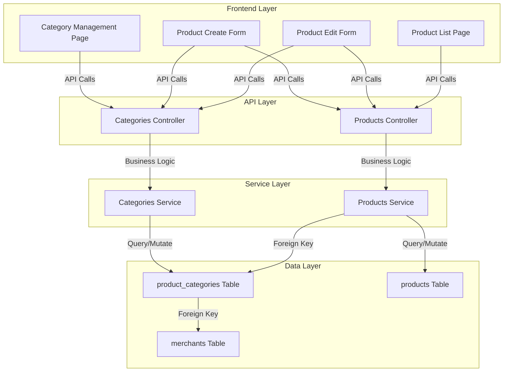
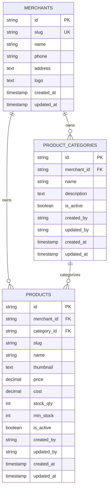
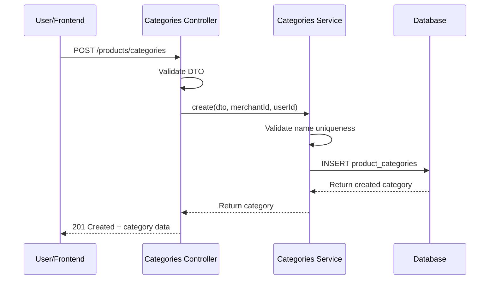
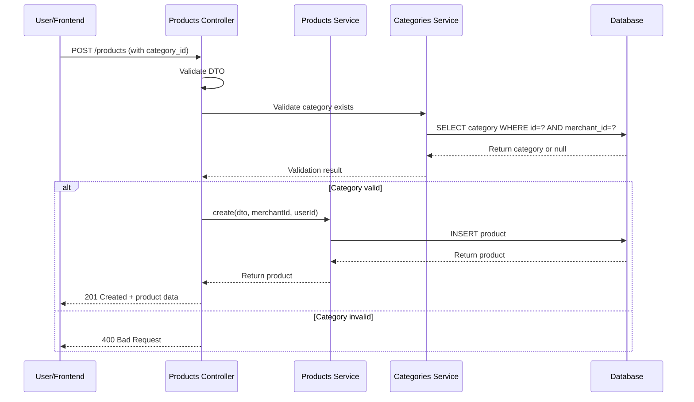
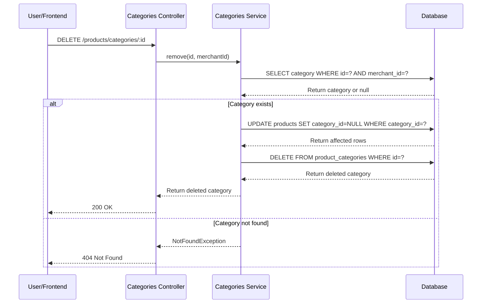
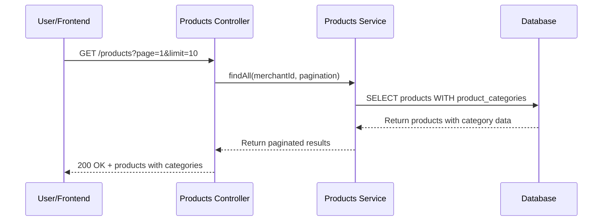

# Product Category Management - Technical Design Document

## Overview

The Product Category Management feature introduces a dedicated, merchant-scoped category system to replace the current simple string-based category field on products. This design document provides comprehensive technical guidance for implementing category creation, management, and integration with the product system.

### Design Goals

1. **Data Normalization**: Replace string-based categories with a proper relational model
2. **Merchant Isolation**: Ensure categories are completely isolated per merchant
3. **User Experience**: Provide dropdown selection instead of free-text input
4. **Scalability**: Support merchants with up to 10,000 products and 500 categories
5. **Maintainability**: Clear separation of concerns with service-oriented architecture

---

## Architecture

### System Architecture Diagram



### Layered Architecture

```
┌─────────────────────────────────────────────────────────┐
│                    Frontend Layer                        │
│  (Vue Components, Forms, State Management)              │
└─────────────────────────────────────────────────────────┘
                          ↓
┌─────────────────────────────────────────────────────────┐
│                    API Layer                             │
│  (Controllers, Request/Response Handling)               │
└─────────────────────────────────────────────────────────┘
                          ↓
┌─────────────────────────────────────────────────────────┐
│                  Service Layer                           │
│  (Business Logic, Validation, Merchant Scoping)         │
└─────────────────────────────────────────────────────────┘
                          ↓
┌─────────────────────────────────────────────────────────┐
│                  Data Access Layer                       │
│  (Prisma ORM, Database Queries)                         │
└─────────────────────────────────────────────────────────┘
                          ↓
┌─────────────────────────────────────────────────────────┐
│                   Database Layer                         │
│  (MySQL Tables, Indexes, Constraints)                   │
└─────────────────────────────────────────────────────────┘
```

---

## Components and Interfaces

### Backend Components

#### 1. Categories Service (`src/products/categories/categories.service.ts`)

**Responsibilities:**
- CRUD operations for categories
- Merchant scoping enforcement
- Validation and business logic
- Audit trail management

**Key Methods:**

```typescript
@Injectable()
export class CategoriesService {
  constructor(private prisma: PrismaService) {}

  // List all categories for a merchant (paginated)
  async findAll(merchantId: string, pagination: PaginationDto): Promise<{
    data: ProductCategory[];
    meta: PaginationMeta;
  }>

  // Get single category (merchant-scoped)
  async findOne(id: string, merchantId: string): Promise<ProductCategory>

  // Create new category
  async create(
    dto: CreateCategoryDto,
    merchantId: string,
    userId: string
  ): Promise<ProductCategory>

  // Update category
  async update(
    id: string,
    dto: UpdateCategoryDto,
    merchantId: string,
    userId: string
  ): Promise<ProductCategory>

  // Delete category (cascade to products)
  async remove(id: string, merchantId: string): Promise<ProductCategory>

  // Get active categories for dropdown (sorted by name)
  async findActiveCategories(merchantId: string): Promise<{
    id: string;
    name: string;
  }[]>
}
```

#### 2. Categories Controller (`src/products/categories/categories.controller.ts`)

**Endpoints:**

| Method | Endpoint | Permission | Description |
|--------|----------|-----------|-------------|
| POST | `/products/categories` | `category.create` | Create new category |
| GET | `/products/categories` | `category.read` | List all categories (paginated) |
| GET | `/products/categories/:id` | `category.read` | Get single category |
| PATCH | `/products/categories/:id` | `category.update` | Update category |
| DELETE | `/products/categories/:id` | `category.delete` | Delete category |
| GET | `/products/categories/active/list` | `category.read` | Get active categories for dropdown |

**Request/Response Examples:**

```typescript
// POST /products/categories
Request: {
  name: "Electronics",
  description: "Electronic devices and accessories",
  is_active: true
}

Response: {
  id: "uuid",
  merchant_id: "uuid",
  name: "Electronics",
  description: "Electronic devices and accessories",
  is_active: true,
  created_by: "uuid",
  updated_by: "uuid",
  created_at: "2024-01-15T10:30:00Z",
  updated_at: "2024-01-15T10:30:00Z"
}

// GET /products/categories?page=1&limit=10
Response: {
  data: [
    { id: "uuid", merchant_id: "uuid", name: "...", ... },
    ...
  ],
  meta: {
    page: 1,
    limit: 10,
    total: 25,
    totalPages: 3
  }
}

// GET /products/categories/active/list
Response: [
  { id: "uuid", name: "Electronics" },
  { id: "uuid", name: "Clothing" },
  ...
]
```

#### 3. DTOs

**CreateCategoryDto:**
```typescript
export class CreateCategoryDto {
  @IsNotEmpty()
  @IsString()
  @MaxLength(100)
  @MinLength(1)
  @Matches(/^[a-zA-Z0-9\s\-_]+$/, {
    message: 'Category name can only contain letters, numbers, spaces, hyphens, and underscores'
  })
  name: string;

  @IsOptional()
  @IsString()
  @MaxLength(500)
  description?: string;

  @IsOptional()
  @IsBoolean()
  is_active?: boolean = true;
}
```

**UpdateCategoryDto:**
```typescript
export class UpdateCategoryDto {
  @IsOptional()
  @IsString()
  @MaxLength(100)
  @MinLength(1)
  @Matches(/^[a-zA-Z0-9\s\-_]+$/)
  name?: string;

  @IsOptional()
  @IsString()
  @MaxLength(500)
  description?: string;

  @IsOptional()
  @IsBoolean()
  is_active?: boolean;
}
```

**CategoryResponseDto:**
```typescript
export class CategoryResponseDto {
  id: string;
  merchant_id: string;
  name: string;
  description?: string;
  is_active: boolean;
  created_by?: string;
  updated_by?: string;
  created_at: Date;
  updated_at: Date;
}
```

### Frontend Components

#### 1. Category Management Page (`src/modules/product/pages/categories.vue`)

**Features:**
- List all categories with pagination
- Create new category via modal form
- Edit category via modal form
- Delete category with confirmation
- Search/filter categories
- Active/inactive toggle

**Component Structure:**
```
CategoryManagementPage
├── CategoryListTable
│   ├── CategoryRow (for each category)
│   │   ├── CategoryName
│   │   ├── CategoryDescription
│   │   ├── ActiveStatus
│   │   └── ActionButtons (Edit, Delete)
│   └── Pagination
├── CreateCategoryButton
├── CategoryFormModal
│   ├── NameInput
│   ├── DescriptionTextarea
│   ├── ActiveToggle
│   └── SubmitButton
└── ConfirmDeleteDialog
```

#### 2. Category Dropdown Component (`src/modules/product/components/CategorySelect.vue`)

**Props:**
```typescript
interface Props {
  modelValue?: string; // selected category ID
  disabled?: boolean;
  placeholder?: string;
}

interface Emits {
  'update:modelValue': [value: string | null];
}
```

**Features:**
- Load active categories on mount
- Display categories sorted by name
- Support for clearing selection
- Error handling for failed loads

#### 3. Product Create Form Updates

**Changes:**
- Replace text input with CategorySelect component
- Validate selected category exists and belongs to merchant
- Update form submission to send `category_id`

```vue
<UiFormGroup label="Category" variant="vertical">
  <CategorySelect
    v-model="form.category_id"
    placeholder="Select a category (optional)"
  />
</UiFormGroup>
```

#### 4. Product Edit Form Updates

**Changes:**
- Same as create form
- Pre-select current category when loading product
- Support clearing category selection

#### 5. Product List Page Updates

**Changes:**
- Display category name instead of raw string
- Add category filter dropdown
- Show placeholder for products without category

---

## Data Models

### Database Schema

#### product_categories Table

```sql
CREATE TABLE product_categories (
  id CHAR(36) PRIMARY KEY DEFAULT (UUID()),
  merchant_id CHAR(36) NOT NULL,
  name VARCHAR(100) NOT NULL,
  description TEXT,
  is_active BOOLEAN DEFAULT true,
  created_at TIMESTAMP DEFAULT CURRENT_TIMESTAMP,
  updated_at TIMESTAMP DEFAULT CURRENT_TIMESTAMP,
  created_by CHAR(36),
  updated_by CHAR(36),
  
  CONSTRAINT fk_product_categories_merchant 
    FOREIGN KEY (merchant_id) 
    REFERENCES merchants(id) 
    ON DELETE CASCADE,
  
  CONSTRAINT unique_merchant_category_name 
    UNIQUE (merchant_id, name),
  
  INDEX idx_product_categories_merchant (merchant_id),
  INDEX idx_product_categories_active (is_active)
);
```

#### products Table (Updated)

```sql
ALTER TABLE products
ADD COLUMN category_id CHAR(36),
ADD CONSTRAINT fk_products_category 
  FOREIGN KEY (category_id) 
  REFERENCES product_categories(id) 
  ON DELETE SET NULL,
ADD INDEX idx_products_category (category_id),
DROP COLUMN category;
```

#### merchants Table (Updated)

```sql
-- Add relation (implicit in Prisma)
-- No schema changes needed, just add relation in Prisma model
```

### Prisma Schema

```prisma
model product_categories {
  id            String    @id @default(dbgenerated("(uuid())")) @db.Char(36)
  merchant_id   String    @db.Char(36)
  name          String    @db.VarChar(100)
  description   String?   @db.Text
  is_active     Boolean   @default(true)
  created_at    DateTime  @default(now()) @db.Timestamp(0)
  updated_at    DateTime  @default(now()) @db.Timestamp(0)
  created_by    String?   @db.Char(36)
  updated_by    String?   @db.Char(36)
  
  merchants     merchants @relation(fields: [merchant_id], references: [id], onDelete: Cascade, onUpdate: NoAction)
  products      products[]
  
  @@unique([merchant_id, name], map: "unique_merchant_category_name")
  @@index([merchant_id], map: "idx_product_categories_merchant")
  @@index([is_active], map: "idx_product_categories_active")
}

model products {
  // ... existing fields ...
  category_id   String?             @db.Char(36)
  
  // ... existing relations ...
  product_categories product_categories? @relation(fields: [category_id], references: [id], onDelete: SetNull, onUpdate: NoAction)
  
  @@index([category_id], map: "idx_products_category")
}

model merchants {
  // ... existing fields ...
  product_categories product_categories[]
}
```

### Entity Relationship Diagram



---

## Data Flow

### 1. Category Creation Flow



### 2. Product Creation with Category Flow



### 3. Category Deletion Flow (Cascade)



### 4. Product List with Category Display Flow



---

## Error Handling

### Error Response Format

```typescript
interface ErrorResponse {
  statusCode: number;
  message: string;
  error: string;
  timestamp: string;
  path: string;
}
```

### Common Error Scenarios

| Scenario | Status | Error Message |
|----------|--------|---------------|
| Missing required field | 400 | "Validation failed: name is required" |
| Category name too long | 400 | "Validation failed: name must not exceed 100 characters" |
| Duplicate category name | 409 | "Category with this name already exists for your merchant" |
| Category not found | 404 | "Category not found" |
| Unauthorized access | 403 | "You do not have permission to perform this action" |
| Invalid category_id in product | 400 | "Invalid category_id: category does not exist or belongs to another merchant" |
| Cross-merchant access attempt | 403 | "You do not have access to this category" |

### Validation Rules

**Category Name:**
- Required, non-empty
- Max 100 characters
- Min 1 character
- Alphanumeric, spaces, hyphens, underscores only
- Unique per merchant

**Category Description:**
- Optional
- Max 500 characters

**is_active:**
- Optional boolean
- Defaults to true

---

## Testing Strategy

### Unit Tests

#### Categories Service Tests

```typescript
describe('CategoriesService', () => {
  describe('create', () => {
    it('should create a category with valid data')
    it('should reject duplicate category names per merchant')
    it('should set created_by and created_at automatically')
    it('should default is_active to true')
    it('should reject empty names')
    it('should reject names exceeding 100 characters')
  })
  
  describe('findAll', () => {
    it('should return paginated categories for merchant')
    it('should not return categories from other merchants')
    it('should support pagination parameters')
  })
  
  describe('findOne', () => {
    it('should return category if it belongs to merchant')
    it('should throw NotFoundException for non-existent category')
    it('should throw NotFoundException for other merchant\'s category')
  })
  
  describe('update', () => {
    it('should update category fields')
    it('should reject duplicate names within merchant')
    it('should update updated_by and updated_at')
    it('should preserve unchanged fields')
  })
  
  describe('remove', () => {
    it('should delete category')
    it('should set category_id to NULL for related products')
    it('should throw NotFoundException for non-existent category')
  })
  
  describe('findActiveCategories', () => {
    it('should return only active categories')
    it('should return sorted by name')
    it('should return only id and name fields')
  })
})
```

#### Categories Controller Tests

```typescript
describe('CategoriesController', () => {
  describe('POST /products/categories', () => {
    it('should require category.create permission')
    it('should validate request DTO')
    it('should return 201 with created category')
    it('should return 409 for duplicate names')
  })
  
  describe('GET /products/categories', () => {
    it('should require category.read permission')
    it('should return paginated categories')
    it('should scope to current merchant')
  })
  
  describe('GET /products/categories/:id', () => {
    it('should require category.read permission')
    it('should return category if accessible')
    it('should return 404 if not found or not accessible')
  })
  
  describe('PATCH /products/categories/:id', () => {
    it('should require category.update permission')
    it('should update category')
    it('should return 404 if not found')
  })
  
  describe('DELETE /products/categories/:id', () => {
    it('should require category.delete permission')
    it('should delete category')
    it('should cascade to products')
    it('should return 404 if not found')
  })
  
  describe('GET /products/categories/active/list', () => {
    it('should require category.read permission')
    it('should return active categories only')
    it('should return sorted by name')
  })
})
```

#### Products Service Tests (Updated)

```typescript
describe('ProductsService', () => {
  describe('create with category', () => {
    it('should create product with valid category_id')
    it('should reject invalid category_id')
    it('should reject category_id from other merchant')
    it('should allow null category_id')
  })
  
  describe('update with category', () => {
    it('should update product category')
    it('should allow clearing category')
    it('should reject invalid category_id')
  })
  
  describe('findAll', () => {
    it('should include category relation')
    it('should display category name in results')
  })
})
```

### Integration Tests

```typescript
describe('Category Management Integration', () => {
  describe('Full CRUD workflow', () => {
    it('should create, read, update, delete category')
    it('should maintain merchant isolation')
    it('should enforce permissions')
  })
  
  describe('Product-Category integration', () => {
    it('should create product with category')
    it('should update product category')
    it('should cascade delete when category deleted')
    it('should display category in product list')
  })
  
  describe('Data migration', () => {
    it('should migrate existing string categories')
    it('should preserve product-category associations')
    it('should handle duplicate category names per merchant')
  })
})
```

### Frontend Tests

```typescript
describe('CategorySelect Component', () => {
  it('should load active categories on mount')
  it('should display categories sorted by name')
  it('should emit update:modelValue on selection')
  it('should support clearing selection')
  it('should handle loading errors')
})

describe('Category Management Page', () => {
  it('should display list of categories')
  it('should create new category')
  it('should edit existing category')
  it('should delete category with confirmation')
  it('should display success/error messages')
})

describe('Product Create Form', () => {
  it('should load categories on mount')
  it('should allow category selection')
  it('should submit with category_id')
  it('should validate category exists')
})

describe('Product Edit Form', () => {
  it('should pre-select current category')
  it('should allow changing category')
  it('should allow clearing category')
})

describe('Product List Page', () => {
  it('should display category names')
  it('should filter by category')
  it('should show placeholder for no category')
})
```

### Test Coverage Goals

- **Unit Tests**: 90%+ coverage for services and controllers
- **Integration Tests**: All CRUD workflows and permission checks
- **Frontend Tests**: All user interactions and error states
- **E2E Tests**: Complete user journeys (create product with category, manage categories, etc.)

---

## Integration Points

### 1. Permission System Integration

**New Permissions:**
- `category.create` - Create categories
- `category.read` - Read categories
- `category.update` - Update categories
- `category.delete` - Delete categories

**Assignment:**
- Admin role: All permissions
- Manager role: All permissions
- Cashier role: `category.read` only

### 2. Audit Trail Integration

**Audit Fields:**
- `created_by`: User ID who created the category
- `created_at`: Timestamp of creation
- `updated_by`: User ID who last updated
- `updated_at`: Timestamp of last update

**Audit Logging:**
- Log category creation
- Log category updates
- Log category deletion

### 3. Merchant Isolation Enforcement

**Scoping Rules:**
- All category queries filtered by `merchant_id`
- All category mutations validated against `merchant_id`
- Cross-merchant access returns 404 (not 403) to prevent information leakage

**Implementation:**
```typescript
// In CategoriesService
private async validateMerchantAccess(categoryId: string, merchantId: string) {
  const category = await this.prisma.product_categories.findFirst({
    where: { id: categoryId, merchant_id: merchantId }
  });
  
  if (!category) {
    throw new NotFoundException('Category not found');
  }
  
  return category;
}
```

### 4. Product Service Integration

**Updates Required:**
- Accept `category_id` in CreateProductDto
- Accept `category_id` in UpdateProductDto
- Validate `category_id` belongs to same merchant
- Include category relation in findAll/findOne
- Handle cascade delete when category deleted

---

## File Organization

### Backend Structure

```
src/products/
├── categories/
│   ├── categories.service.ts
│   ├── categories.controller.ts
│   ├── categories.module.ts
│   └── dto/
│       ├── create-category.dto.ts
│       ├── update-category.dto.ts
│       └── category-response.dto.ts
├── dto/
│   ├── create-product.dto.ts (updated)
│   └── update-product.dto.ts (updated)
├── products.service.ts (updated)
├── products.controller.ts (updated)
└── products.module.ts (updated)
```

### Frontend Structure

```
src/modules/product/
├── pages/
│   ├── categories.vue (new)
│   ├── create.vue (updated)
│   ├── edit.vue (updated)
│   └── list.vue (updated)
├── components/
│   ├── CategorySelect.vue (new)
│   ├── CategoryForm.vue (new)
│   └── CategoryList.vue (new)
├── services/
│   ├── category-api.ts (new)
│   ├── category-types.ts (new)
│   └── types.ts (updated)
└── composables/
    └── useCategories.ts (new)
```

---

## Migration Strategy

### Phase 1: Backend Preparation

1. Create Prisma migration for new schema
2. Implement CategoriesService and Controller
3. Update ProductsService and Controller
4. Add new permissions to database
5. Deploy backend changes

### Phase 2: Data Migration

1. Create migration script to convert string categories
2. Create product_categories records from unique category strings
3. Populate category_id in products table
4. Verify data integrity
5. Remove old category column

### Phase 3: Frontend Implementation

1. Create category API service
2. Create category types
3. Update product types
4. Create category management page
5. Update product create/edit forms
6. Update product list page
7. Deploy frontend changes

### Phase 4: Cleanup

1. Remove old category column from products table
2. Update API documentation
3. Monitor for issues

---

## Performance Considerations

### Database Indexes

- `idx_product_categories_merchant`: Fast merchant-scoped queries
- `idx_product_categories_active`: Fast active category filtering
- `idx_products_category`: Fast product-category lookups
- Unique constraint on (merchant_id, name): Prevents duplicates efficiently

### Query Optimization

**Active Categories Query:**
```sql
SELECT id, name FROM product_categories
WHERE merchant_id = ? AND is_active = true
ORDER BY name ASC
```

**Product List with Categories:**
```sql
SELECT p.*, pc.name as category_name
FROM products p
LEFT JOIN product_categories pc ON p.category_id = pc.id
WHERE p.merchant_id = ?
ORDER BY p.created_at DESC
LIMIT ? OFFSET ?
```

### Performance Targets

- Category list query: < 200ms for 1000 categories
- Active categories query: < 100ms
- Product list with categories: < 300ms for 100 products

---

## Security Considerations

### Merchant Isolation

- All queries include `merchant_id` filter
- Cross-merchant access returns 404 (not 403)
- Foreign key constraints enforce data integrity

### Permission Checks

- All endpoints require appropriate permissions
- Permission validation at controller level
- Service layer assumes valid merchant context

### Input Validation

- Category name: alphanumeric, spaces, hyphens, underscores
- Max lengths enforced
- Whitespace-only names rejected
- SQL injection prevention via Prisma ORM

### Audit Trail

- All mutations tracked with created_by/updated_by
- Timestamps recorded automatically
- Enables compliance and debugging

---

## Rollback Plan

If critical issues occur:

1. **Immediate**: Revert frontend deployment
2. **Short-term**: Keep old `category` column temporarily
3. **Investigation**: Identify and fix issues
4. **Re-attempt**: Re-deploy with fixes

**Rollback Steps:**
1. Restore old `category` column in products table
2. Revert ProductsService to use string categories
3. Revert frontend to use text input
4. Investigate root cause
5. Fix and re-attempt migration

---

## Future Enhancements

1. **Category Hierarchies**: Parent/child category relationships
2. **Category Images**: Add category icons/images
3. **Category Analytics**: Reports by category
4. **Category Pricing**: Category-specific pricing rules
5. **Category Discounts**: Category-level discount rules
6. **Bulk Operations**: Bulk category updates
7. **Category Templates**: Pre-defined category sets
8. **Category Archiving**: Soft delete for historical data

